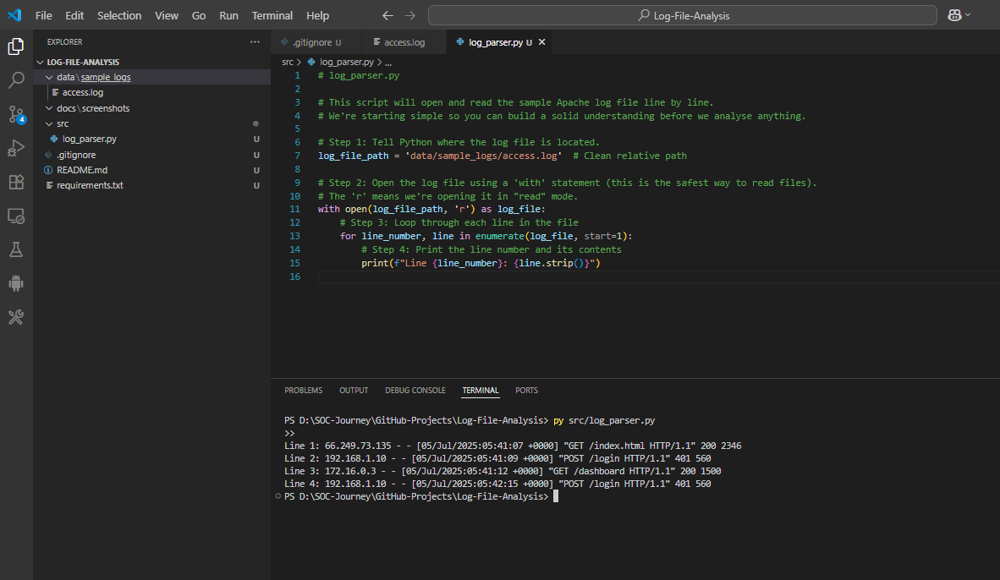
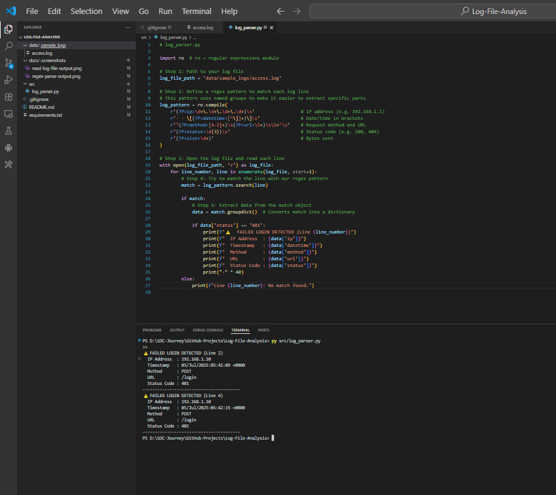
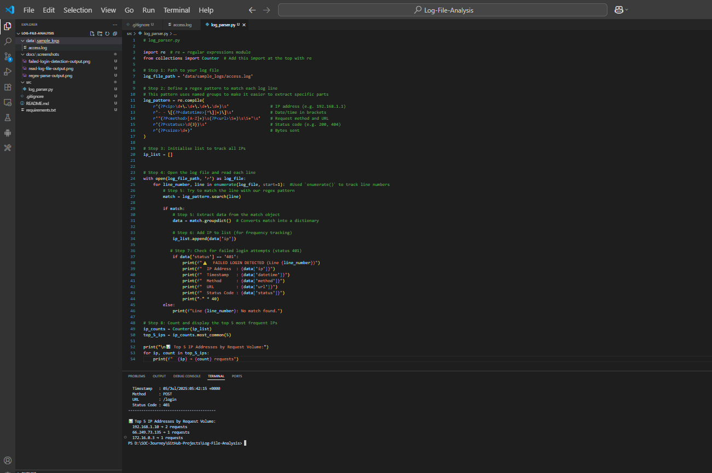
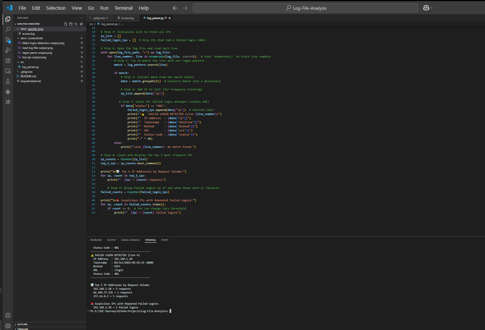

# 🔍 Log File Analysis using Python


This beginner-friendly project simulates a core responsibility of a SOC (Security Operations Centre) analyst: reading and analysing log files to detect suspicious behaviour.

The script parses Apache access logs, detects failed login attempts (HTTP 401), identifies high-volume IP addresses, and flags possible brute-force activity.

---

## 🧠 Why This Project?

> This project demonstrates core SOC analyst skills:
- Log parsing and extraction using **regular expressions**
- **Detection of failed logins** (401 errors)
- Basic **threat pattern recognition** (high-volume or repeated failure IPs)
- Clear, step-by-step logic with structured Python code

---

## 📁 Project Structure

 ```
Log-File-Analysis/

├── data/  
│   ├── sample_logs/
│   └── access.log 
│   
├── docs/
|   ├── screenshots/
│   ├── read-log-file-output.png
│   ├── regex-parse-output.png
│   ├── failed-login-detection-output.png
│   ├── top-ips-output.png
│   └── repeated-failed-logins-output.png
├── src/
│   └── log_parser.py
├── .gitignore
├── requirements.txt
└── README.md
```
---

## 🛠️ Tools & Skills Used

- **Python 3.x**
- `re` for regular expressions
- `collections.Counter` for frequency analysis
- File handling and parsing
- Threat detection logic
- Clean code commenting and documentation

---

## 🚦 Features & Logic

### ✅ Step-by-Step Breakdown:

1. **Read** and iterate through each log line  
2. **Parse** log entries using a regex pattern  
3. **Extract** fields like IP, timestamp, method, URL, status code  
4. **Detect** failed login attempts (HTTP 401)  
5. **Count** all requests by IP address  
6. **Identify** the top 5 IPs by request volume  
7. **Group** failed logins by IP address  
8. **Flag** IPs with 2 or more failed attempts (possible brute-force)  
9. **Display** results clearly in terminal with alerts and summaries

---

## 📸 Screenshots

### ▶️ Reading and Parsing Logs  


### ▶️ Regex Extraction of Log Fields  


### ▶️ Failed Login Detection  


### ▶️ Top IPs by Request Volume  


### ▶️ Grouped Failed Login Attempts  


---

## 🧠 Key Concepts I Learned

- What is a log file?
- How regex can extract structured data from raw logs
- How to detect failed logins using status codes
- Grouping and counting with `Counter()`
- Real-world application of Python in a cybersecurity setting

---

## ✅ Use Case (How This Prepares Me for a SOC Role)

- Understand and explain suspicious IP behaviour
- Write detection logic and simple log analysis scripts
- Communicate findings through structured output
- Reinforce foundational Python skills used by entry-level analysts

---

## 📈 Next Steps / Future Improvements

- Visualise top IPs and failed login trends using `matplotlib`
- Enrich IPs with **GeoIP** lookup (country / ASN)
- Add time-based filtering (e.g., brute-force within 5 min window)
- Save results to a CSV or alert file for SIEM integration

---

## 🙋‍♂️ Author

**Hussien Kofi**  
Cybersecurity Analyst in training  
📧 [Email](mailto:Hussienkofi@gmail.com) • 🔗 [LinkedIn](https://www.linkedin.com/in/hussien-kofi-99a012330/) • 💻 [GitHub](https://github.com/Hussien-K11)

---

## 🛡️ Final Thoughts

This project helped me apply Python in a practical cybersecurity scenario — parsing logs and detecting early signs of attack. It strengthened my understanding of what a SOC analyst looks for in real-world logs, and gave me confidence in building out future threat detection tools from scratch.

