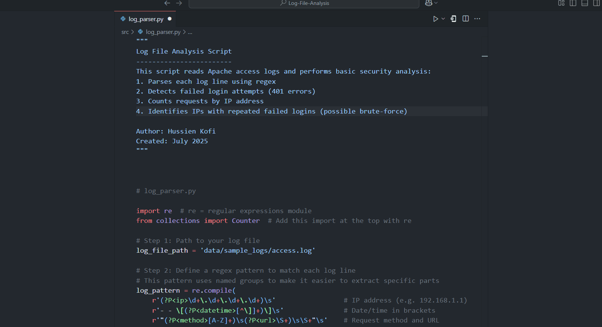

---

# Log File Analysis: Detecting Suspicious Activity with Python


**Status:** ✅ Completed  
**Focus:** SOC Analyst Training & Threat Detection Logic  
**Tech Stack:** Python 3.11, Regex, Log Parsing

---

## ➀ Project Overview

This project simulates a critical SOC (Security Operations Center) responsibility: **analyzing web server logs to identify suspicious behavior**. The Python script scans Apache access logs to:

- Detect **401 Unauthorized login attempts**
- Flag **high-volume IP addresses**
- Identify **possible brute-force patterns**

---

### 🔁 Visual Demo: Watch It In Action

<details>
<summary>▶️ Click to view the animated demo</summary>

<br>

This short demo shows the full script in action — including regex-based parsing, failed login detection, and top IP extraction.

<p align="center">
  
</p>

</details>

---

## ➁ Real-World Relevance

This project was designed to build **practical cybersecurity skills**, including:

- Extracting structured data from logs using **regular expressions**
- Building basic **detection logic** without relying on third-party security platforms
- Grouping and analyzing large volumes of requests
- Interpreting behavioral patterns in raw data

> These are baseline tasks expected of entry-level SOC analysts and incident responders.

---

## ➂ Project Structure


 ```
Log-File-Analysis/

├── data/  
│   ├── sample_logs/
│   └── access.log 
│   
├── docs/
|   ├── screenshots/
│   ├── read-log-file-output.png
│   ├── regex-parse-output.png
│   ├── failed-login-detection-output.png
│   ├── top-ips-output.png
│   └── repeated-failed-logins-output.png
├── src/
│   └── log_parser.py
├── .gitignore
├── requirements.txt
└── README.md
```

---

## ➃ Core Logic & Implementation

Below is a step-by-step summary of the main logic flow in the script.  
Click to expand for a breakdown of how suspicious behaviour is detected:

<details>
<summary>⇨ Detection Flow</summary>

1. **Read** each log entry from Apache access logs  
2. **Parse** lines using regex to extract IPs, timestamps, status codes  
3. **Detect** failed login attempts (HTTP 401 responses)  
4. **Count** total requests per IP address  
5. **Identify** top IPs by request volume  
6. **Group** failed logins by IP  
7. **Flag** IPs with multiple failures (e.g., 2+ 401s)  
8. **Output** summaries in terminal for quick analysis

</details>

---

## ➄ Key Skills Demonstrated

| Skill                        | Description |
|-----------------------------|-------------|
| Log Parsing                 | Used regex to extract structured fields from raw Apache logs |
| Threat Pattern Recognition | Detected brute-force login behavior by analyzing frequency & error codes |
| Python Tooling              | Used `collections.Counter`, file handling, and basic CLI logic |
| SOC Awareness               | Focused on identifying indicators of suspicious access attempts |

---
## ➅ Visual Outputs

These visuals illustrate key stages of the log analysis, including regex parsing, failed login detection, and suspicious IP grouping.

<details>
<summary>Click to expand full screenshots</summary>

<br>

| Screenshot                          | Description                                                      |
|------------------------------------------|------------------------------------------------------------------|
|                | Reading each log entry line-by-line with line numbers            |
|                  | Extracting structured fields using regex (IP, URL, status, etc.) |
|       | Detecting 401 unauthorized attempts and displaying full context  |
|                      | Listing the top IPs based on request volume                      |
|       | Highlighting IPs with 2+ failed login attempts                   |

</details>

---

## ➆ Why This Matters in a SOC Role

This project builds muscle memory for:

- Reading and interpreting real-world logs
- Spotting anomalies without SIEM platforms
- Thinking like a threat analyst
- Turning raw data into actionable insights

> You’re not just scripting, you’re **simulating the detection mindset**.

---
## ➇ Detection Mapping

| Pattern Detected         | Real-World Risk                | Mitigation Insight             |
|--------------------------|--------------------------------|-------------------------------|
| Multiple 401s from 1 IP  | Brute-force login attempt      | Account lockout / rate limiting |
| High request volume from 1 IP | Scanning or enumeration | IP block or alerting in SIEM |
| Requests to `/login` only | Credential stuffing attempt   | MFA or CAPTCHA recommendations |

---

## ➈ What I’d Add Next

| Feature                    | Value Add                        |
|---------------------------|----------------------------------|
| 📊 Data Visualization     | Graph failed logins/IP activity using `matplotlib` |
| 🌍 GeoIP Lookup           | Enrich IP data with geolocation |
| ⏱️ Time-Based Filtering  | Detect brute-force within short time windows |
| 📁 SIEM Output Format     | Export results for further analysis or alerting |

---

## 👤 Author

**Hussien Kofi**  
Aspiring Cybersecurity Analyst  
📧 [Email](mailto:Hussienkofi@gmail.com)  
🔗 [LinkedIn](https://www.linkedin.com/in/hussien-kofi-99a012330/)  
💻 [GitHub](https://github.com/Hussien-K11)

---

## 🧭 Final Reflection

This project wasn’t just about writing a script, it was about learning how to think like an analyst. I translated raw logs into actionable intelligence, practiced detection logic, and took a step closer to real-world SOC workflows.

---

## ✅ TL;DR

- **Language:** Python 3.11  
- **Focus:** Threat detection via log analysis  
- **Skills:** Regex, log parsing, frequency analysis, brute-force identification  
- **Outcome:** Reinforced key SOC-level capabilities with a clean, documented solution
- **Demo:** [See script in action ↗](#🔁-visual-demo-watch-it-in-action)


